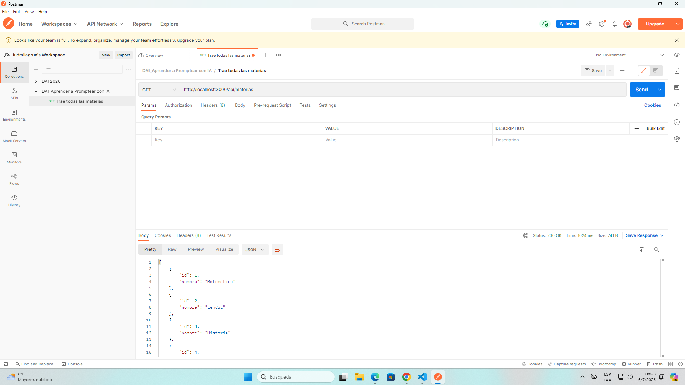

# 📓 Bitácora de Prompts — Ejercicio N° 01

## Datos

**Alumno/a:** Ludmila Grun y Delfina Kaltman
**Ejercicio:** N.° 01 — Nueva tabla y su CRUD
**Fecha:** 3/7
**Modelo de IA usado:** ChatGPT

---

# 1. 🎯 Qué me pidieron

El objetivo fue agregar una nueva entidad llamada **materias** siguiendo exactamente la arquitectura que ya tenía el proyecto. Para eso tuve que generar el CRUD completo respetando el mismo patrón utilizado en las entidades de alumnos y cursos, sin cambiar la estructura ni agregar nuevas dependencias.

---

# 2. 💬 Mis prompts (en orden)

## Prompt #1

### Lo que escribí:

*(Pegar el prompt que usaste.)*

### Auto-chequeo de las 5 partes EFSI

✅ Rol

✅ Contexto

✅ Tarea

✅ Restricciones

✅ Iteración

### Qué me devolvió (resumen)

La IA generó el archivo **materias-repository.js** respetando la arquitectura del proyecto. Utilizó la clase `DbPg`, implementó los métodos del CRUD y escribió las consultas SQL usando placeholders (`$1`, `$2`, etc.).

### ¿Me sirvió tal cual, o tuve que corregir/repreguntar?

Me sirvió casi completo, pero lo revisé para comprobar que siguiera exactamente el mismo estilo que `cursos-repository.js`. Verifiqué especialmente que no accediera directamente al Pool y que utilizara los mismos métodos de `DbPg`.

---

## Prompt #2

### Lo que escribí

El repository quedó correcto.

Ahora generá únicamente **materias-service.js**.

Debe seguir exactamente el mismo patrón que **cursos-service.js**.

No agregues lógica nueva.

No modifiques el repository.

No generes todavía el controller.

### Por qué necesité este segundo prompt

Seguí el proceso recomendado por el TP, generando una capa por vez para poder revisar cada archivo antes de continuar y detectar posibles errores más fácilmente.

### Qué me devolvió (resumen)

La IA generó el archivo `materias-service.js`, manteniendo el mismo patrón utilizado en el resto del proyecto y delegando correctamente las operaciones al repository.

### ¿Me sirvió?

Sí. Solo revisé que los nombres de los métodos coincidieran con los del repository y que no hubiera lógica adicional.

---

## Prompt #3

### Lo que escribí

El service quedó correcto.

Ahora generá únicamente **materias-controller.js**.

Debe seguir exactamente el mismo patrón que `cursos-controller.js`.

Respetá los mismos códigos de estado HTTP, el manejo de errores y validá que en el método PUT el id de la URL coincida con el del body, igual que en `alumnos-controller.js`.

No modifiques el service ni el repository.

### Por qué necesité este tercer prompt

Quería generar el controller por separado para revisar con más facilidad las respuestas HTTP, las validaciones y el manejo de errores.

### Qué me devolvió (resumen)

La IA generó el controller completo con los cinco endpoints CRUD y el manejo de respuestas HTTP correspondiente.

### ¿Me sirvió?

Sí, aunque revisé especialmente la validación del PUT y los códigos de estado antes de incorporarlo al proyecto.

---

## Prompt #4

### Lo que escribí

Ahora indicame únicamente qué modificación debo hacer en `server.js` para registrar el nuevo controller de materias.

Mostrame solamente el import y la línea de `app.use()`.

### Por qué necesité este cuarto prompt

Preferí modificar solamente la parte necesaria del archivo para evitar cambios innecesarios.

### Qué me devolvió (resumen)

Indicó el import del controller y la línea para registrar `/api/materias` dentro del servidor.

### ¿Me sirvió?

Sí. Solo agregué esas líneas al archivo existente.

---

# 3. 🔧 Qué hizo la IA y qué hice yo

| Archivo / función      | Lo generó la IA | Lo modifiqué/escribí yo | ¿Por qué?                                                                                                |
| ---------------------- | --------------- | ----------------------- | -------------------------------------------------------------------------------------------------------- |
| materias-repository.js | ✔               | ✔                       | Revisé el código y adapté pequeños detalles para que coincidiera exactamente con el estilo del proyecto. |
| materias-service.js    | ✔               | ✔                       | Verifiqué nombres de métodos y consistencia con el repository.                                           |
| materias-controller.js | ✔               | ✔                       | Revisé las respuestas HTTP, la validación del PUT y el manejo de errores.                                |
| server.js              | ✘               | ✔                       | Registré manualmente el nuevo controller y la ruta `/api/materias`.                                      |
| Base de datos          | ✘               | ✔                       | Ejecuté el script SQL para crear las tablas y cargar los datos de prueba.                                |

---

# 4. 🐛 Errores o cosas mal que detecté en la respuesta de la IA

Detecté algunos detalles que revisé antes de usar el código:

* Verifiqué que todas las consultas utilizaran placeholders (`$1`, `$2`) y no concatenación de strings.
* Comprobé que el repository utilizara únicamente la clase `DbPg` y no creara conexiones nuevas a PostgreSQL.
* Revisé que el controller devolviera los códigos HTTP correctos según cada caso.
* Comparé el código generado con el de `cursos` para asegurar que mantuviera exactamente el mismo estilo y estructura.

---

# 5. ✅ Verificación

✔ Ejecuté el script SQL y se crearon correctamente las tablas `materias` y `calificaciones`.

✔ Verifiqué que el repository utilizara `DbPg`.

✔ Confirmé que todas las consultas utilizaran placeholders.

✔ Registré correctamente `/api/materias` en `server.js`.

✔ Probé los cinco endpoints CRUD desde Postman.

✔ Confirmé que no se agregaron dependencias nuevas en `package.json`.

**Evidencia utilizada:** pruebas realizadas con Postman y funcionamiento correcto de los endpoints.

---

# 6. ✍️ Reflexión

En este ejercicio trabajé utilizando la IA como una herramienta de apoyo y no simplemente para generar todo el código de una vez. En lugar de pedir el CRUD completo en un solo prompt, seguí el proceso recomendado por la guía del trabajo práctico y fui generando cada capa por separado: primero el repository, después el service, luego el controller y finalmente la modificación necesaria en el servidor.

Antes de escribir los prompts analicé cómo estaba organizado el proyecto para que la IA pudiera respetar la arquitectura existente. Le di contexto sobre el uso de Express, PostgreSQL, la arquitectura en capas y la clase `DbPg`, además de indicarle las restricciones para que no cambiara el estilo ni agregara dependencias nuevas.

Después de cada respuesta revisé el código generado antes de continuar. Comparé cada archivo con los equivalentes de la entidad `cursos`, comprobé que se utilizaran placeholders en las consultas SQL, que el acceso a la base de datos estuviera delegado en `DbPg` y que el controller devolviera los códigos HTTP esperados. También revisé la validación del método PUT para asegurarme de que siguiera el mismo comportamiento que el resto del proyecto.

Este ejercicio me mostró que un buen resultado depende mucho de la calidad del prompt. Al darle contexto y restricciones claras, la IA produjo código mucho más parecido al existente y necesitó muy pocos ajustes. También aprendí que revisar el resultado es una parte fundamental del proceso, porque aunque el código funcione, siempre es necesario comprobar que respete la arquitectura, el estilo y las buenas prácticas del proyecto.

---

# 7. 🔗 Adjuntos

* Link/PDF de la conversación completa con la IA: https://chatgpt.com/share/6a47cd85-ec64-83e9-959c-4cf47ce5f788
* Commit(s) en GitHub: ____________
* Capturas de Postman con las pruebas realizadas.

